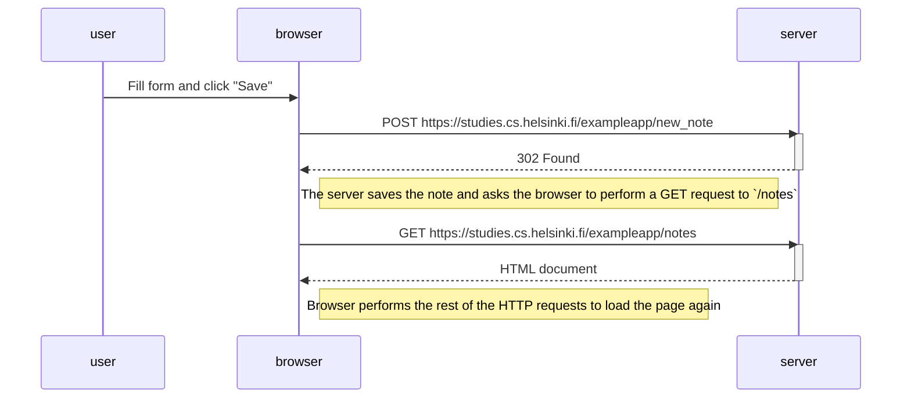

```mermaid
sequenceDiagram
    participant user
    participant browser
    participant server

    user->>browser: Fill form and click "Save"
    browser->>server: POST https://studies.cs.helsinki.fi/exampleapp/new_note
    activate server
    server-->>browser: 302 Found
    deactivate server

    Note right of browser: The server saves the note and asks the browser to perform a GET request to `/notes`

    browser->>server: GET https://studies.cs.helsinki.fi/exampleapp/notes
    activate server
    server-->>browser: HTML document
    deactivate server 

    Note right of browser: Browser performs the rest of the HTTP requests to load the page again
```