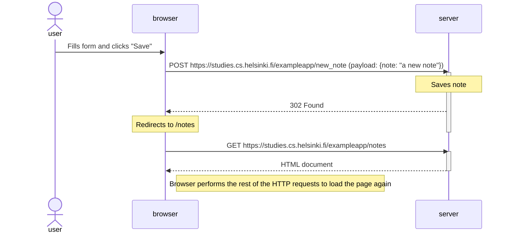

```mermaid
sequenceDiagram
    actor user
    participant browser
    participant server

    user->>browser: Fills form and clicks "Save"
    browser->>server: POST https://studies.cs.helsinki.fi/exampleapp/new_note (payload: {note: "a new note"})
    activate server
    Note over server: Saves note
    server-->>browser: 302 Found
    Note over browser: Redirects to /notes
    deactivate server

    browser->>server: GET https://studies.cs.helsinki.fi/exampleapp/notes
    activate server
    server-->>browser: HTML document
    deactivate server 

    Note right of browser: Browser performs the rest of the HTTP requests to load the page again
```