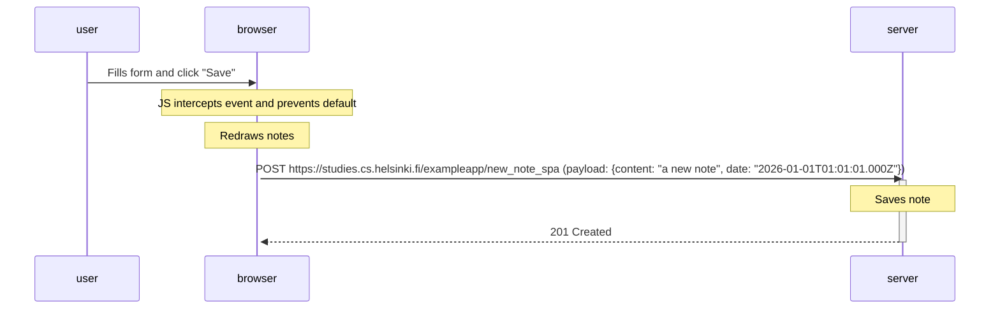

```mermaid
sequenceDiagram
    participant user
    participant browser
    participant server

    user->>browser: Fills form and click "Save"

    activate browser
    Note over browser: JS intercepts event and prevents default

    Note over browser: Redraws notes

    browser->>server: POST https://studies.cs.helsinki.fi/exampleapp/new_note_spa (payload: {content: "a new note", date: "2026-01-01T01:01:01.000Z"})
    
    activate server
    Note over server: Saves note
    server-->>browser: 201 Created
    deactivate server
```